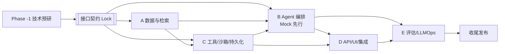
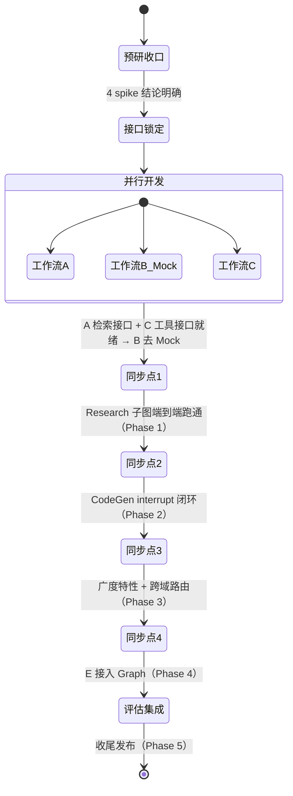

# QuantMind — AI 协作分工方案

> 谁做什么（Who）。基于复杂度评估选择协作模式，把项目拆成 5 条高内聚低耦合的工作流，明确依赖、时间线与同步点。
>
> **版本**：v1.0（Draft）

---

## 🎯 一、项目目标

实现一个基于 LangGraph 的多子图量化研究 + 求职 Agent，覆盖混合检索 RAG、三级验证代码生成、跨域路由、长期记忆与求职追踪，并接入 LangSmith 评估。

---

## 📊 二、复杂度评估

```yaml
项目名称: QuantMind — Quant Research & Career Copilot
复杂度评估:
  业务复杂度: 中高     # 10 个用户场景，4 个子图，跨域协调
  技术复杂度: 高       # LangGraph 编排 + 混合检索 + 沙箱 + 三层持久化 + LLMOps，多为新技能
  时间紧迫度: 低       # 学习型项目，质量优先于速度

建议协作模式:
  团队规模: 5 条工作流（专职协调）
  协调模式: 专职协调（大型项目，协调者工作量占比 ~60-80%）
  预计时间: 6 个 Phase（+ 1 个预研 Phase），节奏由质量驱动
  自由度档位: Explore（预研期）→ Balanced（契约 Lock 后并行）→ Strict（临近评估/收尾）
```

**判定依据**（对照《新项目启动指南》复杂度表）：技术复杂度高 + 多模块系统 → 属「系统重构/大型功能」级别 → **4+ 工作流 + 专职协调**。

---

## 👥 三、工作流分工

> 本项目不是典型「前端/后端/数据库」三分，而是按 AI Agent 系统的架构层切分。每条工作流可由一个独立 AI 会话或开发批次承担。

### 工作流 A：数据与检索地基（Data & Retrieval）
- **负责模块**：`ingestion/`（arxiv_fetcher / pdf_parser / chunker / pipeline）、`vector_store/qdrant_client.py`、`data/concepts`、`data/sample`
- **关键交付**：
  - [ ] arXiv API 拉取 + PyMuPDF 解析 + 分块 pipeline
  - [ ] Qdrant 四 collection 建库 + **Sparse+Dense 混合检索**（RRF）
  - [ ] 50 篇种子论文 + 概念库 YAML + sample OHLCV CSV
  - [ ] 暴露 `VectorStore` 接口（见接口契约 §C1）
- **依赖**：无（**最先启动**，是其他工作流的地基）
- **验收**：混合检索对"Fama-French"类精确术语 recall 明显优于纯 dense；ingestion 幂等可重跑

### 工作流 B：Agent 编排核心（Orchestration）
- **负责模块**：`agents/`（router / supervisor / research_agent / codegen_agent / planning_agent / interview_agent）、**LangGraph State Schema**、Checkpointer 接线
- **关键交付**：
  - [ ] 定义并冻结 State Schema（见接口契约 §C0）
  - [ ] Research / CodeGen / Planning / Interview 四个 subgraph
  - [ ] Intent Router（multi-mode）+ Supervisor 跨域协调
  - [ ] Checkpointer 接入（interrupt/resume 机制）
- **依赖**：VectorStore 接口（A）、Tool 接口（C）—— **均可先用 Mock**
- **验收**：Research 子图能阻止幻觉并优雅降级；CodeGen interrupt 可暂停/恢复；跨域问题正确合并

### 工作流 C：工具 / 沙箱 / 持久化（Tools & Persistence）
- **负责模块**：`tools/`（T1-T8）、`sandbox/sandbox_runner.py`、`db/`（models / notes_repo / application_repo）、`memory/user_memory.py`
- **关键交付**：
  - [ ] T1-T8 工具实现（包装 VectorStore / DB / Store）
  - [ ] subprocess 沙箱（30s 超时、stdout/stderr 捕获、禁网络 import 校验）
  - [ ] PostgreSQL models + research_notes / applications / ingestion_log Repo
  - [ ] LangGraph Store 封装（user profile / bookmarks / plan progress）+ applications 状态机
- **依赖**：VectorStore 接口（A）、DB schema（自定义）
- **验收**：工具签名与方案文档 §5 一致；沙箱能捕获执行失败并返回结构化结果；状态机转换合法性校验

### 工作流 D：API / UI / 集成（Integration）
- **负责模块**：`main.py`、`config.py`、`ui/streamlit_app.py`、`Dockerfile`、`docker-compose.yml`、`.env.example`
- **关键交付**：
  - [ ] FastAPI 入口 + 请求/响应模型（见接口契约 §C5）
  - [ ] Streamlit MVP（含 **interrupt 确认表单**渲染）
  - [ ] Docker Compose（app + qdrant + postgres 一键启动）
  - [ ] config / 环境变量管理 + `llm_client.py` 抽象
- **依赖**：Graph 入口（B）、FastAPI 模型（自定义）
- **验收**：`docker-compose up` 一键拉起；Streamlit 能完成一次完整 interrupt 确认闭环

### 工作流 E：评估与 LLMOps（Eval & LLMOps）
- **负责模块**：`eval/`（evaluators / run_eval）、`data/benchmarks/`（120 条）、LangSmith 接入、`scripts/run_benchmarks.py`、CI
- **关键交付**：
  - [ ] 120 条 benchmark JSONL（4 分类，严格字段格式）
  - [ ] 自动化 evaluators（ast.parse / subprocess / keyword）+ LLM-as-judge（忠实度/引用正确性）
  - [ ] LangSmith offline eval runner + dashboard
  - [ ] GitHub Actions（lint + test + 小规模 eval）
- **依赖**：端到端可调用的 Graph（B/C/D）
- **验收**：eval 可重复运行；全维度 metrics 在 dashboard 可见

---

## 🔗 四、依赖关系与启动顺序



**启动顺序原则**：
1. **预研先行**：Phase -1 完成后才定稿接口契约。
2. **先 Lock 后并行**：接口契约 ACK→Lock 之前，禁止 A/B/C 大规模并行实现。
3. **地基优先**：A（数据检索）与 C（持久化 schema）先行，B 用 Mock 并行启动。
4. **集成靠后**：D 在 B 有可运行 Graph 后接入；E 的 benchmark 数据可提前准备，evaluator 接入靠后。

---

## 📅 五、并行开发时间线（相对节奏，非日历日）

```mermaid
gantt
    title QuantMind 工作流时间线（按 Phase 对齐）
    dateFormat X
    axisFormat %s

    section 预研
    Phase -1 四件套 spike      :p0, 0, 3

    section 契约
    接口契约 Proposal-Lock     :p1, 3, 2

    section A 数据检索
    ingestion + Qdrant 混合检索 :a1, 5, 4
    种子数据 + 概念库            :a2, 9, 2

    section C 工具持久化
    DB models + Repo            :c1, 5, 3
    Tools T1-T8 + Sandbox       :c2, 8, 4
    Store + 状态机               :c3, 12, 3

    section B 编排核心
    State Schema + Research 子图 :b1, 7, 5
    CodeGen 子图 + interrupt    :b2, 12, 4
    Router/Supervisor/Planning  :b3, 16, 4

    section D 集成
    FastAPI + config            :d1, 12, 3
    Streamlit + interrupt 表单  :d2, 15, 4
    Docker Compose              :d3, 19, 2

    section E 评估
    120 条 benchmark            :e1, 9, 6
    evaluators + LangSmith      :e2, 20, 4
    CI + 收尾                    :e3, 24, 3
```



---

## 🔄 六、关键同步点（集成检查点）



| 同步点 | 触发条件 | 验证方式 |
|--------|---------|---------|
| SP1 | A 检索接口 + C 工具接口可用 | B 用真实工具替换 Mock，契约测试通过 |
| SP2 | Research 子图端到端 | 跑"解释动量因子"，trace 可见，verify 生效 |
| SP3 | CodeGen interrupt 闭环 | Streamlit 完成确认→生成→执行 |
| SP4 | 广度特性完成 | S7-S10 场景演示 |
| SP5 | 评估接入 | 120 条 benchmark 跑出 dashboard |

---

## 🚦 七、协作守则（Guardrails）

- **先 Lock 后并行**：接口契约未锁定不得并行实现。
- **合并前契约测试必过**：未通过不得入主分支。
- **变更四步走**：任何接口变更走 Proposal→Review→ACK→Lock，记录 Changelog 与影响面。
- **职责不交叉**：每条工作流独占其 `src/` 子目录；跨目录改动需协调者协调。
- **每完成一个同步点更新**：`渐进性开发记录.md`（过程）+ `memory/全局纪要.md`（精华）。

---

## 📐 八、工作流子任务细化（AI 会话粒度）

每条工作流内部进一步拆分为「AI 会话级」子任务。每个子任务 = 一个任务包（Task Pack），可独立交给一个 AI 会话（手动开 Cursor 新会话或 subagent）执行。

| 子任务 ID | 工作流 | 名称 | 依赖 |
|----------|--------|------|------|
| A1 | A | Ingestion pipeline（arxiv_fetcher / pdf_parser / chunker / pipeline） | 无 |
| A2 | A | Qdrant 四 collection 建库 + VectorStore.search 混合检索封装 | A1（ingestion 写入） |
| B1 | B | **State Schema 定稿 + Research Subgraph**（check_confidence/hybrid_search/synthesize/verify/format/graceful_decline） | A2 接口 Lock（可 Mock 先行） |
| B2 | B | **CodeGen Subgraph**（parse_strategy / interrupt / search_code / generate / validate / execute / explain） | C3（sandbox）可 Mock 先行 |
| B3 | B | Planning Subgraph + Interview Subgraph | B1 State Schema 定稿后 |
| B4 | B | **Intent Router + Supervisor**（multi-mode 路由 + 跨域结果合并） | B1/B2/B3 完成后 |
| C1 | C | DB models + Repo（research_notes / applications 状态机 / ingestion_log） | 无 |
| C2 | C | T1-T8 工具实现（包装 VectorStore / DB / Store） | A2 + C1 接口 |
| C3 | C | Sandbox Runner（subprocess + 超时 + 禁 import 校验） | 无 |
| C4 | C | LangGraph Store 封装（UserMemory：profile / bookmarks / plans） | 无 |
| D1 | D | FastAPI 入口 + `llm_client.py` + `config.py` + `.env.example` | B 任意子图可运行 |
| D2 | D | Streamlit MVP + interrupt 确认表单 + Docker Compose | D1 |
| E1 | E | 120 条 benchmark 数据制作（4 分类 JSONL，严格字段格式） | 可提前独立并行 |
| E2 | E | evaluators（ast / subprocess / LLM-judge）+ LangSmith offline eval runner | E1 + 端到端 Graph 可调用 |
| E3 | E | GitHub Actions CI（lint + test + 小规模 eval） | E2 |

**Subagent 适用建议**：
- 预研期（Phase -1）：由协调者 AI 直接执行（上下文连贯，结论可实时回写契约）。
- **E1（benchmark 数据）**：最适合 subagent，内容工作量大、独立性强，可在 Phase 1 结束后并行启动。
- **A1/C1/C3**：彼此无依赖，契约 Lock 后可 subagent 并行启动。
- **B1/B2/B3**：核心难度大，建议手动会话并 review，不要交给无监督 subagent。

## 🧭 九、单人执行说明

本方案以「多 AI 并行」建模，同样适用于单开发者**串行**推进：把上表的子任务当作开发批次，按依赖顺序（A1→A2 / C1/C3 并行 → B1→B2→B3→B4 / D1→D2 / E1 提前）逐个完成即可。接口契约先行的价值在单人模式下依然成立——让每个批次边界清晰、可独立测试。

---

*本方案随项目演进更新。复杂度或边界发生变化时，由协调者重新评估并调整工作流划分。*
