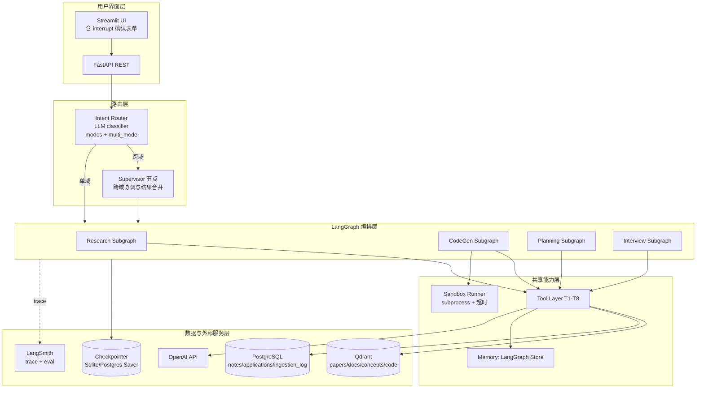
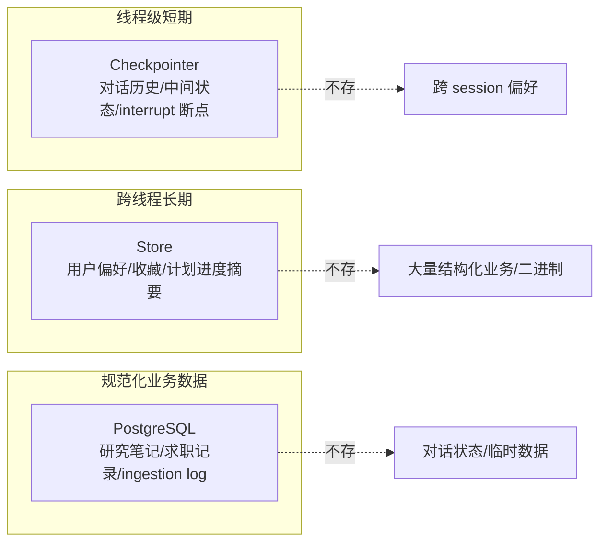
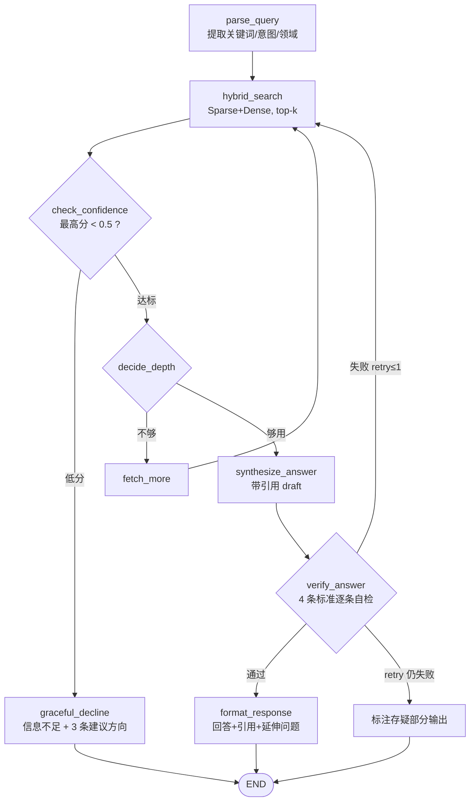
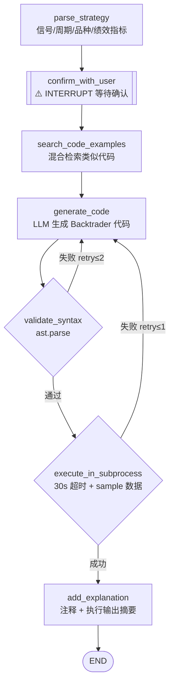
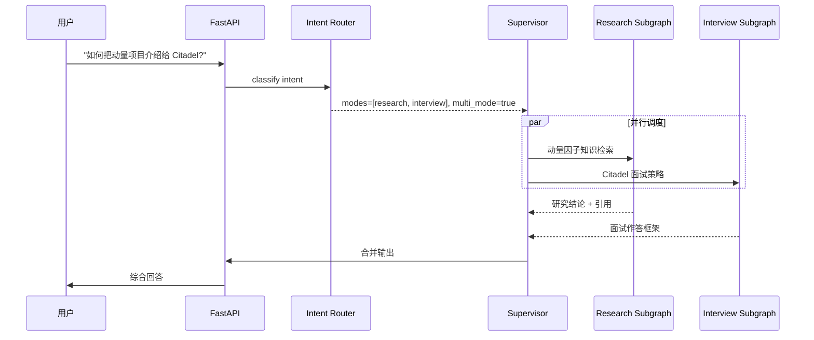
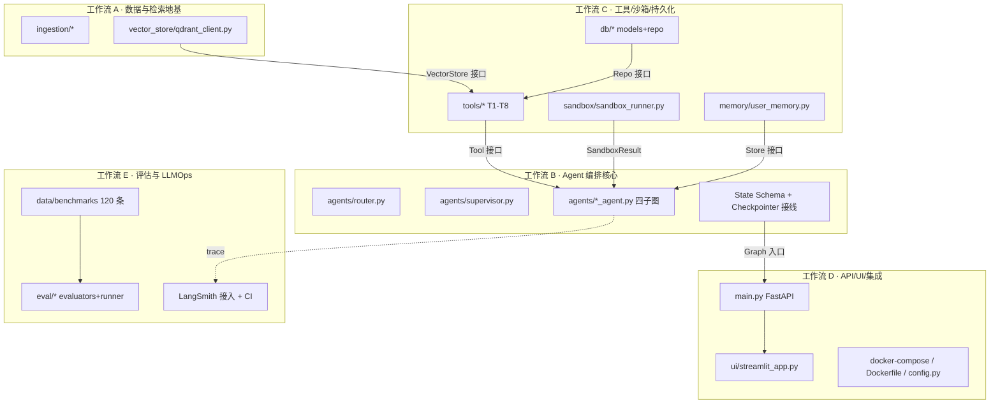

# QuantMind — 技术实施方案

> 从方案文档（What/Why）到可执行落地（How）的桥梁。本文档聚焦：系统架构、模块分解、数据流、Phase 实施计划、验收标准。
>
> **版本**：v1.0（Draft）| **对应方案文档**：quant-research-agent-proposal v1.3.1

---

## 📋 一、执行概要

### 项目目标
构建一个基于 LangGraph 的多子图量化研究 + 求职 Agent，具备混合检索 RAG、带三级验证的代码生成、跨域路由、长期记忆与求职追踪能力，并接入 LangSmith 做全链路可观测与离线评估。

### 核心指标

| 维度 | 指标 | 目标值 | 优先级 |
|------|------|--------|--------|
| 检索质量 | Recall@5 | ≥ 0.75 | P0 |
| 引用正确性 | Citation accuracy（per-claim） | ≥ 0.85 | P0 |
| 回答忠实度 | Faithfulness（LLM-judge 1-5） | ≥ 4.0 | P0 |
| 代码可靠性 | subprocess 执行成功率 | ≥ 0.80 | P0 |
| 防幻觉 | 低置信度 graceful_decline 命中 | 100% 触发 | P1 |
| 延迟 | P95 单查询延迟 | ≤ 8s | P2 |
| 成本 | Tokens/query（embedding + LLM 分开统计） | 可观测即可 | P2 |

### 技术栈速览
LangGraph · Qdrant（Sparse+Dense 混合）· OpenAI（GPT-4o-mini / text-embedding-3-small）· LangSmith · FastAPI · Streamlit · PostgreSQL · Docker Compose · GitHub Actions

### 时间规划
6 个 Phase（对应方案文档 §10 里程碑），预研先行。详见 §四与 `AI协作分工方案.md` 甘特图。

---

## 🏗️ 二、系统架构

### 2.1 整体分层架构

### 2.2 三层持久化分离（严格遵守，避免双源混乱）

### 2.3 Research Subgraph（Plan-then-Execute-then-Verify）

> verify_answer 4 条标准：①是否真正回答了具体问题；②每个关键声明是否有检索段落支撑（per-claim 0/1）；③是否引入无来源新声明（幻觉检测）；④证据不足时是否明确说明"不确定"。

### 2.4 CodeGen Subgraph（含 Human-in-the-Loop interrupt）

### 2.5 跨域路由（Multi-mode）数据流

---

## 🧩 三、模块分解（映射到 5 条工作流）

代码层结构遵循方案文档 §9。这里把它聚合为 **5 条高内聚、低耦合的工作流**，每条工作流可由一个 AI 会话/开发批次独立推进，通过 `模块接口契约.md` 衔接。

| 工作流 | 负责模块（src/ 路径） | 核心产出 | 主要依赖 |
|--------|---------------------|---------|---------|
| **A 数据与检索地基** | `ingestion/`、`vector_store/`、`data/concepts`、`data/sample` | 可用的 ingestion pipeline + Qdrant 混合检索 | 无（最先启动） |
| **B Agent 编排核心** | `agents/`、State Schema、Checkpointer 接线 | 四个 subgraph + Router + Supervisor | Tool 接口（可 Mock）、VectorStore 接口 |
| **C 工具/沙箱/持久化** | `tools/`、`sandbox/`、`db/`、`memory/` | T1-T8 工具 + subprocess 沙箱 + Repo + Store 封装 | VectorStore 接口、DB schema |
| **D API/UI/集成** | `main.py`、`config.py`、`ui/`、Docker | FastAPI + Streamlit（含 interrupt 表单）+ Compose | Graph 入口、FastAPI 模型 |
| **E 评估与 LLMOps** | `eval/`、`data/benchmarks/`、CI | 120 条 benchmark + evaluators + LangSmith dashboard | 端到端可调用的 Graph |

> 关键解耦点：B 在 A/C 未就绪时，可依赖 `模块接口契约.md` 中冻结的接口 + Mock 先行开发；E 可独立准备 benchmark 数据集，等 Graph 可调用后接入。

---

## 🔧 四、Phase 实施计划

> 与方案文档 §10 里程碑对齐，并补充「Phase -1 技术预研」作为正式开发前置（详见 `技术预研计划.md`）。

### Phase -1：技术预研（预研先行）
- **目标**：在写核心代码前，用最小 demo 验证 4 个高风险技术点：LangGraph（subgraph + checkpointer + interrupt + Store）、Qdrant 混合检索、LangSmith trace、subprocess 沙箱。
- **交付**：4 份可运行的 spike 脚本 + 结论记录（写入 `渐进性开发记录.md`）。
- **退出条件**：每个 spike 的「关键问题」均有明确答案，接口契约可据此定稿。

### Phase 0：地基（对应工作流 A + D 部分）
- Docker Compose 跑通 Qdrant + Postgres；arXiv 拉取 ~20 篇论文完成 ingestion（含 Sparse 向量）；LangGraph Hello World + Checkpointer 验证。
- **交付**：`docker-compose.yml` + ingestion pipeline + Qdrant 混合检索可用。

### Phase 1：核心 RAG + Verify（工作流 B 主导，依赖 A/C）
- Research Subgraph 完整跑通（check_confidence → hybrid_search → synthesize → verify[4 条] → format / graceful_decline）；LangSmith tracing 接入；引用展示。
- **交付**：能回答"解释动量因子"类问题，verify 阻止幻觉，低置信度优雅降级，trace 可见。

### Phase 2：CodeGen + Sandbox（工作流 B + C + D）
- CodeGen Subgraph（human-in-the-loop interrupt + subprocess 执行验证）；`sandbox_runner.py`；FastAPI 接口；Streamlit MVP。
- **交付**：Streamlit 展示 interrupt 确认流程 + 代码执行输出。

### Phase 3：完整 Agent + 广度特性（工作流 B + C + D）
- Intent Router（multi-mode）；Supervisor 跨域协调；Planning Subgraph；LangGraph Store 长期记忆；Application Tracking 状态机；Interview×Research 跨域混合问答。
- **交付**：S7-S10 场景全部跑通；Store 读写验证；applications 状态机演示。

### Phase 4：评估（工作流 E 主导）
- 120 条 benchmark（4 分类，严格字段）；LangSmith offline eval；全维度 metrics（含 citation accuracy、code_exec_rate、graceful_decline rate）。
- **交付**：eval report + LangSmith dashboard。

### Phase 5：收尾
- Docker 完整打包；CI（含 eval 自动化）；README + demo video。
- **交付**：可公开的 GitHub 仓库。

---

## ✅ 五、验收标准

### 功能验收（按场景）
- [ ] S1-S5 Research/Concept/CodeGen 主路径可跑通
- [ ] S2 代码生成走完三级验证（语法→执行→输出）且 interrupt 确认生效
- [ ] S6 面试题结合 Store 中用户项目经历做定制
- [ ] S7 研究规划产出有序多步计划并存入 Store
- [ ] S8 跨 session 读取用户 profile 实现个性化
- [ ] S9 跨域问题触发多 subgraph 并合并输出
- [ ] S10 求职追踪状态机转换正确

### 质量验收
- [ ] 核心指标（§一）全部达到目标值或有明确改进路径
- [ ] 三层持久化职责无越界（Checkpointer/Store/PostgreSQL）
- [ ] 所有请求在 LangSmith 可见完整 trace
- [ ] 关键模块有单元/契约测试，CI 绿灯

### 工程验收
- [ ] `docker-compose up` 一键拉起 app + qdrant + postgres
- [ ] `.env.example` 完整，README 可复现实验
- [ ] 120 条 benchmark + eval 脚本可重复运行

---

## ⚠️ 六、风险与缓解

| 风险 | 概率 | 影响 | 缓解措施 |
|------|------|------|----------|
| LangGraph interrupt/resume 与 Streamlit 集成复杂 | 中 | 高 | Phase -1 spike 先验证；UI 端确认表单做最小闭环 |
| Qdrant 混合检索（Sparse 向量）配置踩坑 | 中 | 中 | spike 跑通官方 hybrid 示例后再封装 |
| 检索 recall < 0.75 | 中 | 中 | 数据从 50 篇起步边评边扩；Reranker 列为 Phase 2 升级路径 |
| subprocess 执行安全/超时 | 中 | 中 | 禁网络 import 校验 + 30s 超时 + sample 静态 CSV |
| 多 provider / LLM 切换返工 | 低 | 中 | 抽象 `llm_client.py` 接口，先单 provider |
| 模块边界在并行开发中漂移 | 中 | 高 | 先 Lock 接口契约后并行；合并前契约测试必过 |

---

*本方案随 Phase 推进更新；重大架构变更需回到「Proposal→Review→ACK→Lock」流程并记录影响面。*
