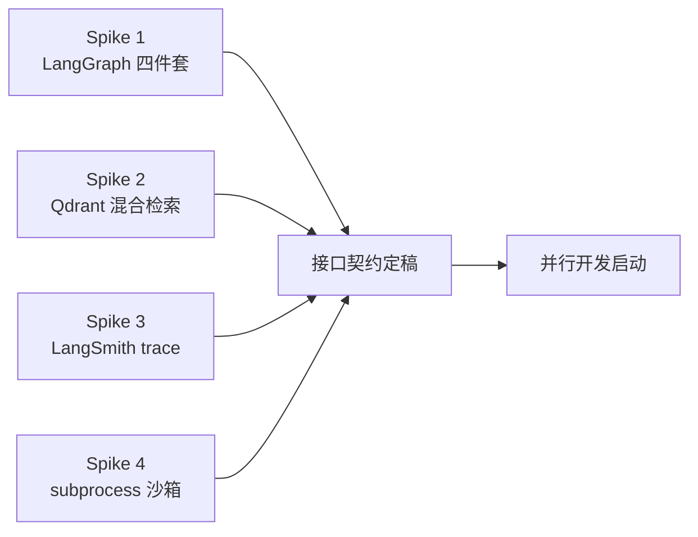
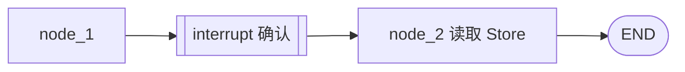

# QuantMind — 技术预研计划（Phase -1）

> 写核心代码前先验证高风险技术点。每个 spike 是一个 time-boxed 的最小可运行 demo，目标是回答「关键问题」，而非实现功能。结论回写 `渐进性开发记录.md`，并据此定稿 `模块接口契约.md`。
>
> **自由度档位**：Explore | **版本**：v1.0

---

## 为什么要预研先行

本项目大量技术是当前技能缺口（LangGraph、Qdrant 混合检索、LangSmith）。在不确定 API 行为的情况下直接写核心代码，会导致接口契约反复返工。预研用最小成本把不确定性前置消化。



> ⚠️ **版本核对**：LangGraph / langchain / qdrant-client / langsmith 的 API 演进较快。每个 spike 第一步先 `pip show` 锁定版本并对照**当前官方文档**，本文件中的 API 名称以官方文档为准（如有出入以文档为准并在记录中标注）。

---

## Spike 1：LangGraph 四件套（最高优先级）

- **Time-box**：1-1.5 天
- **要验证的 4 个机制**：
  1. **Subgraph 组合**：父图如何调用子图、子图 State 如何映射到父图 State
  2. **Checkpointer**：`SqliteSaver` 如何按 `thread_id` 持久化对话；中断后能否 resume
  3. **Interrupt（human-in-the-loop）**：`interrupt()` / `Command(resume=...)` 如何暂停在 `confirm_with_user` 节点并恢复
  4. **Store（跨线程长期记忆）**：`InMemoryStore` 的 namespace 读写，与 Checkpointer 的边界

### 关键问题（必须有答案）
- [ ] 子图与父图共享 State 的字段映射方式？是否需要 input/output schema？
- [ ] `interrupt()` 触发后，State 如何保存？`/resume` 时如何把用户编辑的 `strategy_spec` 注入回流程？
- [ ] Checkpointer 与 Store 能否同时挂在一个 graph 上？各自配置项？
- [ ] Supervisor 并行调度多个子图（multi-mode）的标准写法？（fan-out/fan-in 还是 Send API？）

### 交付
- `spikes/langgraph_demo.py`：一个含 1 个 interrupt 节点 + checkpointer + store 的最小三节点图
- 结论：确认 §C0 State Schema 与 §C5 interrupt/resume 模型可行



---

## Spike 2：Qdrant Sparse + Dense 混合检索

- **Time-box**：0.5-1 天
- **要验证**：Qdrant（Docker 本地）启用 **Sparse + Dense 双向量** 并用 RRF / fusion query 融合排名

### 关键问题
- [ ] Sparse 向量怎么生成？（Qdrant/BM25 风格 sparse encoder，还是 fastembed？）
- [ ] collection 如何同时配置 dense（1536 维）与 sparse 两个 named vector？
- [ ] 混合查询的 API 写法（fusion=RRF）与返回结构？如何拿到融合后 score？
- [ ] 对"Fama-French""Sharpe Ratio"这类精确术语，hybrid 是否真的优于纯 dense？（做一个对比小样本）

### 交付
- `spikes/qdrant_hybrid_demo.py`：建一个含 dense+sparse 的 collection，索引 ~10 段文本，跑 hybrid vs dense 对比
- 结论：确认 §C1 `VectorStore.search` 的返回结构与 `use_hybrid` 行为

---

## Spike 3：LangSmith Trace + Eval 接入

- **Time-box**：0.5 天
- **要验证**：trace 自动上报 + 一个最小 offline eval（dataset + evaluator）

### 关键问题
- [ ] 仅靠环境变量（`LANGCHAIN_TRACING_V2` 等）能否自动 trace LangGraph 全链路？
- [ ] 如何把 120 条 JSONL 导入为 LangSmith dataset？
- [ ] LLM-as-judge evaluator 与自定义（代码执行）evaluator 的注册方式？
- [ ] embedding token 与 LLM token 能否在 trace 中分开统计？

### 交付
- `spikes/langsmith_demo.py`：跑一次带 trace 的调用 + 一个 2 条样本的 offline eval
- 结论：确认 §一核心指标的可观测路径

---

## Spike 4：subprocess 代码执行沙箱

- **Time-box**：0.5 天
- **要验证**：隔离 subprocess 执行生成代码，超时控制 + stdout/stderr 捕获 + 禁网络 import 校验

### 关键问题
- [ ] 30s 超时如何可靠实现（`subprocess.run(timeout=)` + 杀子进程）？
- [ ] 如何在执行前静态检测 `requests/urllib/socket` 等禁用 import（ast 遍历）？
- [ ] Backtrader 在隔离进程跑 sample CSV 的最小可运行例子？输出里能否稳定出现 "Sharpe"/"Final Portfolio Value"？
- [ ] 执行失败时错误信息如何结构化返回给 LLM 做自动修复？

### 交付
- `spikes/sandbox_demo.py`：给一段含/不含网络 import 的代码，验证校验 + 执行 + 超时三种路径
- 结论：确认 §C7 `SandboxRunner.run` 与 `SandboxResult` 结构

---

## 预研退出条件（进入并行开发的门槛）

```markdown
- [ ] Spike 1-4 的「关键问题」全部有明确答案，结论写入渐进性开发记录
- [ ] 据预研结论，模块接口契约 §C0/§C1/§C5/§C7 完成 Review → ACK → Lock
- [ ] 待决策项 D1/D2/D3（见 context/业务需求）有初步结论
- [ ] 锁定各依赖库版本（写入 requirements.txt 草案）
```

> 这些 spike 代码放在临时 `spikes/` 目录，验证完即可归档或删除，不进入正式 `src/`。其结论才是真正的交付物。

---

*预研是一次性投资，省下的是后期反复返工的成本。结论务必沉淀，不要只停留在"跑通了"。*
