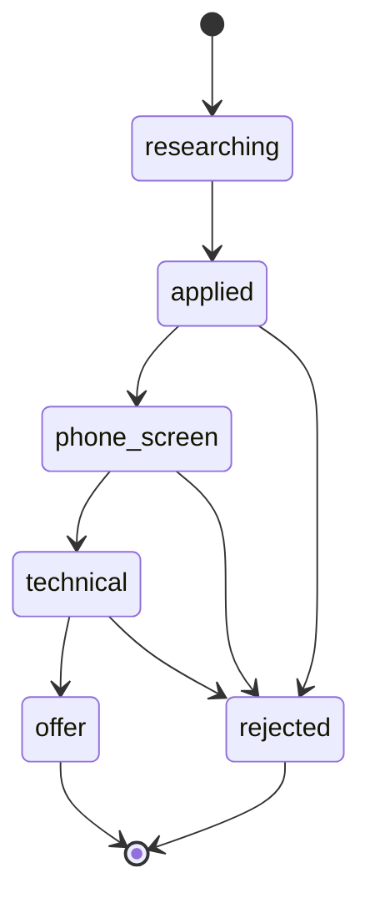

# QuantMind — 模块接口契约

> 🔒 模块如何衔接（先 Lock 后并行）。本项目无传统前后端分离，契约对象是 **Python 模块间的接口**：State Schema、VectorStore、Tool 签名、DB Repo、Memory Store、FastAPI 模型、LLM Client。
>
> **版本**：v1.0（🔒 LOCKED，2026-06-21）

---

## 协商状态

- [x] **Proposal**：接口草案已完成
- [x] **Review**：三轮外部 AI 审核，共 14 个阻塞问题全部修复（2026-06-21）
- [x] **ACK**：项目负责人确认（2026-06-21）
- [x] **Lock**：🔒 接口已冻结（2026-06-21）—— 各工作流现在可以并行开发

> 🔒 **Lock 已生效**。本文件签名均已冻结。任何变更必须走「Proposal→Review→ACK→Lock」流程并升版本号（v1.1、v2.0 等）。

---

## §C0 LangGraph State Schema（工作流 B 拥有，全员消费）

所有 subgraph 共享的状态结构。下方先定义各共享数据类型，再定义 `AgentState`。

### 共享数据类型

```python
from typing import TypedDict, Literal, Optional, Annotated
from dataclasses import dataclass, field
from langgraph.graph.message import add_messages

Mode = Literal["research", "codegen", "planning", "interview"]


# —— 路由决策 ——
# （审核意见：modes + multi_mode 是双真相，改为单一 RouteDecision）
class RouteDecision(TypedDict):
    primary_mode: Mode
    fanout_modes: list[Mode]    # multi_mode = len(fanout_modes) > 1，派生，不手写
    reason: str
    confidence: float


# —— 查询意图 ——
# （审核意见：query_intent: dict 太粗，改为结构化）
class QueryIntent(TypedDict):
    keywords: list[str]
    domain: str
    intent: str
    doc_type: str | None    # "paper" / "concept" / "code" / None
    time_range: str | None


# —— 验证结果 ——
# （审核意见：verify_passed: bool 与"四条标准"不匹配，改为 VerificationResult）
@dataclass
class VerificationResult:
    answers_question: bool       # 标准 1：是否真正回答了具体问题
    claims_grounded: bool        # 标准 2：每个关键声明有检索段落支撑
    no_hallucination: bool       # 标准 3：未引入无来源新声明
    uncertainty_stated: bool     # 标准 4：证据不足时是否明确说明不确定
    score: float                 # 综合评分 0–1
    threshold_used: float        # 记录判定所用阈值，方便调参和审计（默认 0.75）
    failure_reasons: list[str]   # 失败原因（方便 LLMOps 分析）
    # ⚠️ allow_output 只允许 verifier 节点写入（由 score >= threshold_used 派生）。
    # 其他节点只读，不可写；禁止人工回填。
    # 违反此约束会导致 score=0.82 但 allow_output=False 的歧义状态。
    allow_output: bool


# —— 引用 ——
# （审核意见：citations: list[dict] 太粗，改为强类型）
class Citation(TypedDict):
    paper_id: str
    title: str
    section: str | None
    relevance_score: float


# —— 子图输出分桶 ——
# （审核意见：subgraph_outputs 浅合并会静默覆盖，改为按 mode 命名的分桶）
class SubgraphOutput(TypedDict):
    mode: Mode
    result: str | None
    citations: list[Citation]
    error: str | None


def _merge_named_outputs(
    a: dict[str, SubgraphOutput],
    b: dict[str, SubgraphOutput],
) -> dict[str, SubgraphOutput]:
    """各子图以 mode 为 key 写入，key 不同故不会静默覆盖。
    ⚠️ Invariant：每个 mode 在同一轮 fan-out 中只能产出一个结果。
    如果同一 mode 被多个分支并发写入，后写会覆盖先写（dict 合并语义）。
    当前设计保证每种 mode 的 subgraph 在一轮 Supervisor fan-out 中只调度一次。
    """
    return {**a, **b}


# —— retry_counts reducer ——
# ⚠️ 阻塞修复（第二轮审核）：普通 dict 没有 reducer，并行分支写同一 channel 会触发
# InvalidUpdateError。各子图应只写自己的 key（如 {"research": 1}），reducer 取最大值避免
# 同 key 并发递增时的歧义（退化情况：两个分支同时写 research → 取较大的那个）。
def _merge_retry_counts(a: dict[str, int], b: dict[str, int]) -> dict[str, int]:
    merged = dict(a)
    for k, v in b.items():
        merged[k] = max(merged.get(k, 0), v)
    return merged
```

### AgentState

```python
class AgentState(TypedDict):
    # —— 输入与路由 ——
    messages: Annotated[list, add_messages]    # 对话历史（Checkpointer 管理）
    user_id: str                               # 用于 Store namespace
    route: Optional[RouteDecision]             # Intent Router 输出（替代原 modes + multi_mode）

    # —— 检索/研究中间态 ——
    query_intent: Optional[QueryIntent]
    retrieved: Optional[list["SearchResult"]]  # hybrid_search 产出
    confidence: Optional[float]                # check_confidence 产出：top-1 相似度
    draft_answer: Optional[str]
    verification: Optional[VerificationResult] # 替代原 verify_passed: bool

    # —— 代码生成中间态 ——
    strategy_spec: Optional[dict]              # parse_strategy 产出（待用户确认）
    generated_code: Optional[str]
    sandbox_result: Optional["SandboxResult"]

    # —— 输出 ——
    final_response: Optional[str]
    citations: Optional[list[Citation]]

    # —— 重试计数（各子图独立，带 reducer 防并发写冲突）——
    # ⚠️ 阻塞修复：无 reducer 的 dict 在并行分支中写同一 channel 会触发 InvalidUpdateError
    retry_counts: Annotated[dict[str, int], _merge_retry_counts]  # {"research": 0, "codegen": 0, ...}

    # —— 跨域协调（Supervisor）——
    # （审核意见：浅合并的 dict 有命名冲突风险，改为命名分桶）
    subgraph_outputs: Annotated[dict[str, SubgraphOutput], _merge_named_outputs]
```

> **设计约束**：State 只放流转所需的中间态；跨 session 偏好走 Store，业务数据走 PostgreSQL（三层持久化）。
>
> **⚠️ 子图隔离**：subgraph schema 不同时，必须用 wrapper node 显式做 parent↔subgraph 映射（Spike 1 验证）。当 research/codegen 复杂度上升到 Phase 3+，可考虑把子图专属字段抽成独立 `ResearchState`/`CodeGenState`，通过 wrapper 传递，避免 mega TypedDict。当前 MVP 阶段统一 State，逻辑更简单。

---

## §C1 VectorStore 接口（工作流 A 拥有，B/C 消费）

### 共享数据类型

```python
from dataclasses import dataclass, field
from typing import Literal

Collection = Literal["papers", "docs", "concepts", "code_snippets"]


@dataclass
class SearchResult:
    # ⚠️ 字段顺序：无默认值字段必须在有默认值字段之前（Python dataclass 规则）
    text: str
    fusion_score: float          # RRF 融合后分数（明确命名，避免与原始相似度混淆）
    doc_id: str
    chunk_id: str
    source: str                  # "arxiv" / "manual" / ...
    paper_id: str | None
    title: str | None
    section: str | None
    year: int | None
    # 以下字段有默认值，必须放在所有无默认值字段之后
    authors: list[str] = field(default_factory=list)   # docs/concepts 无作者时为空列表
    url: str | None = None
    metadata: dict = field(default_factory=dict)       # 其余不固定的字段


# —— 检索规格 ——
# （审核意见：use_hybrid: bool 过于粗糙，改为可扩展 RetrievalSpec）
@dataclass
class RetrievalSpec:
    mode: Literal["hybrid", "dense", "sparse"] = "hybrid"
    top_k: int = 5
    prefetch_k: int = 20         # hybrid 模式先多取再融合
    score_threshold: float | None = None
    filters: dict | None = None  # Qdrant filter payload（如 year/authors）
    rerank: bool = False         # Phase 2 升级路径（当前为 False）


# —— upsert 参数 ——
# （审核意见：list[dict] 无法约束向量维度和 id 类型）
@dataclass
class PointRecord:
    id: str
    text: str
    dense_vector: list[float] | None = None   # None = 由 VectorStore 内部自动 embed
    sparse_vector: dict | None = None          # None = 由 VectorStore 内部自动生成
    payload: dict = field(default_factory=dict)


@dataclass
class UpsertResult:
    upserted_count: int
    point_ids: list[str]
    errors: list[str]            # 部分失败时记录
```

### VectorStore 接口

```python
class VectorStore:
    def search(
        self,
        query: str,
        collection: Collection,
        spec: RetrievalSpec | None = None,     # None = 使用默认 hybrid top-5
    ) -> list[SearchResult]: ...

    def search_batch(
        self,
        queries: list[str],
        collection: Collection,
        spec: RetrievalSpec | None = None,
    ) -> list[list[SearchResult]]: ...

    def upsert(self, collection: Collection, items: list[PointRecord]) -> UpsertResult: ...

    def delete(self, collection: Collection, ids: list[str]) -> None: ...
```

**错误约定**：
- `VectorStoreUnavailable`：检索服务不可用
- `CollectionNotFound`：collection 不存在
- `InvalidEmbeddingDim`：向量维度不匹配
- `BackendTimeout`：Qdrant 超时
- 空结果返回 `[]`（不抛异常，由 `check_confidence` 处理）

---

## §C2 Tool 接口（工作流 C 拥有，B 消费）

### 统一返回类型

```python
from dataclasses import dataclass

@dataclass
class ToolResult:
    ok: bool
    tool_name: str               # 方便 UI 和重试策略统一处理
    data: dict                   # 约定：data 必须包含 "result_type" 键
    error: str | None = None
    error_code: str | None = None   # "NOT_FOUND" / "TIMEOUT" / "VALIDATION_ERROR" / ...
    retryable: bool = False
```

### 工具签名

```python
# T1  search_papers(
#         query: str,
#         collection: Collection,
#         spec: RetrievalSpec | None = None,   # ⚠️ 与 C1 VectorStore 对齐，废弃旧 use_hybrid: bool
#     ) -> ToolResult

# T2  fetch_paper_details(paper_id: str) -> ToolResult

# T3  generate_backtest_code(
#         strategy_description: str,
#         framework: str = "backtrader",
#         asset_class: str | None = None,
#         timeframe: str | None = None,
#     ) -> ToolResult

# T4  explain_concept(concept: str, depth: str = "technical") -> ToolResult

# T5  generate_interview_questions(
#         jd_text: str,
#         company: str | None = None,
#         focus_areas: list[str] | None = None,
#         num_questions: int = 10,
#     ) -> ToolResult

# T6  create_research_plan(
#         user_id: str,
#         goal: str,
#         current_level: str | None = None,
#         num_steps: int = 5,
#         idempotency_key: str | None = None,  # 唯一性规则：(user_id, goal) 去重；
#     ) -> ToolResult                          # 提供 key 时优先按 key 去重

# T7  update_user_memory(
#         user_id: str,
#         memory_type: Literal["profile", "bookmark", "plan"],  # 与 C4 三条路径一一对应
#         content: dict,
#     ) -> ToolResult

# T8  track_application(
#         user_id: str,
#         company: str,
#         position: str,
#         action: str,
#         status: str | None = None,
#         notes: str | None = None,
#         idempotency_key: str | None = None,  # 唯一性规则：(user_id, company, position) 去重；
#     ) -> ToolResult                          # 提供 key 时优先按 key 去重
```

**约定**：
- 工具内部不直接操作 LangGraph State；副作用（写 DB/Store）通过 §C3/§C4 接口完成，确保工具可独立 Mock 测试
- **幂等性约定**（⚠️ 阻塞修复，第三轮审核）：LangGraph interrupt 恢复会从节点开头重跑，工具必须可重复调用
  - `track_application`：以 `(user_id, company, position)` 为唯一键；已存在则返回已有 id，不创建重复
  - `create_research_plan`：以 `(user_id, goal)` 为唯一键；已存在则返回已有 id，不创建重复
  - 两者均支持传入 `idempotency_key` 显式覆盖默认唯一性规则

---

## §C3 DB Repo 接口（工作流 C 拥有，C/D 消费）

对应 PostgreSQL 三张表（research_notes / applications / ingestion_log）。

```python
class NotesRepo:
    # （审核意见：补充 user_id，支持跨线程聚合与权限隔离）
    def create(self, user_id: str, thread_id: str, title: str, content: str, sources: list[dict]) -> str: ...
    def get(self, note_id: str) -> dict | None: ...
    def list_by_user(self, user_id: str) -> list[dict]: ...
    def list_by_thread(self, thread_id: str) -> list[dict]: ...


class ApplicationRepo:
    # （审核意见：补充 user_id，多用户系统必须；list_all→list_by_user）
    def create(self, user_id: str, company: str, position: str, status: str = "researching") -> str: ...
    def update_status(
        self,
        app_id: str,
        new_status: str,
        expected_status: str | None = None,    # 可选乐观锁，避免并发脏更新
    ) -> None: ...
    def add_notes(self, app_id: str, notes: str) -> None: ...
    def list_by_user(self, user_id: str) -> list[dict]: ...


class IngestionLogRepo:
    def record(
        self,
        source_type: str,
        source_id: str,
        collection: str,
        status: str,
        chunk_count: int,
        doc_id: str | None = None,
        error_message: str | None = None,
        checksum: str | None = None,
    ) -> str: ...
```

**状态机约定**：`update_status` 必须校验合法转换（见 §C3.1），非法转换抛 `InvalidTransition`。

### §C3.1 Application 状态机合法转换



> （审核意见：v0.1 缺少 `technical → rejected`，已补充）

---

## §C4 Memory Store 接口（工作流 C 拥有，B 消费）

封装 LangGraph Store，namespace 隔离。

```python
# Namespace 约定（统一规则，避免各工作流各自发明路径）：
# Profile:   ("user", user_id, "profile")
# Bookmarks: ("user", user_id, "bookmarks")
# Plans:     ("user", user_id, "plans")
#
# 节点内通过 langgraph.config.get_store() 获取底层 store，不作为函数参数注入

@dataclass
class Profile:
    research_interests: list[str] = field(default_factory=list)
    target_roles: list[str] = field(default_factory=list)
    skill_level: str | None = None
    preferences: dict = field(default_factory=dict)


class UserMemory:
    def get_profile(self, user_id: str) -> Profile | None: ...    # None = 新用户，不与空 dict 混淆
    def update_profile(self, user_id: str, patch: dict) -> None: ...

    def add_bookmark(self, user_id: str, paper_id: str, note: str) -> None: ...
    def list_bookmarks(self, user_id: str) -> list[dict]: ...
    def delete_bookmark(self, user_id: str, paper_id: str) -> None: ...

    def get_research_plans(self, user_id: str) -> list[dict]: ...
    def upsert_plan_progress(self, user_id: str, plan_id: str, steps: list[dict]) -> None: ...
    def remove_research_plan(self, user_id: str, plan_id: str) -> None: ...
```

**约定**：Store 只存**摘要级**长期记忆；大量结构化记录（如完整 applications）落 PostgreSQL，Store 仅存 summary。`steps` 中每项至少包含 `step_id`, `status`, `updated_at`。

---

## §C5 FastAPI 请求/响应模型（工作流 D 拥有，UI 消费）

```python
from pydantic import BaseModel, Field
from typing import Optional, Literal


# POST /chat
class ChatRequest(BaseModel):
    user_id: str
    thread_id: str               # LangGraph 会话游标，换了就是新线程，不与业务 id 混用
    message: str


class InterruptPayload(BaseModel):
    interrupt_id: str            # LangGraph Interrupt.id，恢复时必须携带（审核意见）
    type: Literal["confirm_strategy"]
    strategy_spec: dict


class ChatResponse(BaseModel):
    thread_id: str
    status: Literal["ok", "interrupt"]         # 显式状态，前端不必靠 interrupt 是否为 None 推断
    response: str | None = None                # status="ok" 时有值；status="interrupt" 时为 None
    citations: list["Citation"] = Field(default_factory=list)  # 与 State.citations 类型统一
    interrupt: Optional[InterruptPayload] = None  # status="interrupt" 时有值


# POST /resume —— 用户确认 interrupt 后，用 Command(resume=...) 恢复
class ResumeRequest(BaseModel):
    thread_id: str
    interrupt_id: str            # 必须携带，对应 InterruptPayload.interrupt_id（审核意见）
    edited_spec: dict            # 作为 Command(resume=edited_spec) 传入


# /resume 返回新的 ChatResponse，前端可做一轮完整闭环
```

**约定（Spike 1 验证 + 第二轮审核修复）**：
- `interrupt()` 不抛异常，结果在 `invoke()` 返回值的 `__interrupt__` 键；`__interrupt__[0].id` 即 `interrupt_id`
- ⚠️ **阻塞修复**：FastAPI 恢复时必须按 id 传值，不能传裸 value：
  ```python
  # ✅ 正确：按 interrupt_id 映射，支持多 interrupt 场景
  graph.invoke(Command(resume={req.interrupt_id: req.edited_spec}), config)
  # ❌ 错误（v0.2 写法）：传裸值只在单 interrupt 时偶然正确
  graph.invoke(Command(resume=req.edited_spec), config)
  ```
- ⚠️ **节点重入约束**：LangGraph resume 时会从含 `interrupt()` 的节点**开头重新执行**，不是从中间继续。因此，`confirm_with_user` 节点（含 `interrupt()`）必须满足：
  1. `interrupt()` 调用之前不能有不可回滚的副作用（如写 DB、发消息）
  2. 节点逻辑必须幂等可重放（多次执行结果相同）
  3. 所有副作用应在 `interrupt()` 返回值取回之后执行

**Checkpointer 选型**：

| 场景 | 推荐 | 说明 |
|------|------|------|
| 本地开发 / 单进程 | `SqliteSaver` | 简单，with 上下文管理器包裹 |
| FastAPI 生产多 worker | `AsyncPostgresSaver` | SqliteSaver 不支持多线程扩展 |

---

## §C6 LLM Client 抽象（共享工具，全员消费）

```python
from dataclasses import dataclass


# —— 返回类型 ——
# （审核意见：只返回 str 无法支持成本统计和 LLMOps 评估）
@dataclass
class LLMResult:
    text: str
    model: str
    usage: dict       # {"input_tokens": int, "output_tokens": int, "total_tokens": int}
    latency_ms: int


class LLMClient:
    def chat(self, messages: list[dict], model: str | None = None, **kw) -> LLMResult: ...
    def chat_structured(
        self,
        messages: list[dict],
        schema: type["BaseModel"] | dict,      # 支持 Pydantic model 或 JSON schema
        model: str | None = None,
    ) -> dict: ...
    def chat_stream(self, messages: list[dict], model: str | None = None):
        """yield str chunks，UI 和 verifier 流式消费用。"""
        ...


# —— Embedding 独立拆出 ——
# （审核意见：embed 和 chat 职责不同，应拆开；避免 provider 切换时相互影响）
class EmbeddingClient:
    model: str   # "BAAI/bge-small-en-v1.5"
    dim: int     # 384

    def embed(self, texts: list[str]) -> list[list[float]]: ...
```

**约定**：`LLMClient` 默认 `model="deepseek-chat"`（DeepSeek V3）；复杂推理显式传 `model="deepseek-reasoner"`（DeepSeek R1）。`EmbeddingClient` 固定走本地 fastembed，不经 LLM provider，避免联网依赖和额外 token 费用。

---

## §C7 Sandbox 接口（工作流 C 拥有，B 消费）

```python
from dataclasses import dataclass
from typing import Literal


# —— 三阶段结果 ——
# （审核意见：单次 run() 无法表达三阶段，LLM 无法定位失败位置）
@dataclass
class SandboxResult:
    success: bool
    phase: Literal["syntax", "execute", "output"]   # 成功 = output；失败 = 卡在哪一步
    stdout: str
    stderr: str      # 程序标准错误（与 error 区分：error 是沙箱/执行器层错误）
    exit_code: int | None
    timed_out: bool
    error: str | None     # 沙箱/执行器错误（非程序 stderr）
    error_code: Literal[
        "SYNTAX_ERROR",
        "FORBIDDEN_IMPORT",
        "RUNTIME_ERROR",
        "TIMEOUT",
        "OUTPUT_VALIDATION_FAILED",
    ] | None


class SandboxRunner:
    def run(
        self,
        code: str,
        sample_data_path: str,      # 只读文件路径
        timeout_s: int = 30,
    ) -> SandboxResult: ...
```

**安全约定**：
1. 执行前静态校验（`ast` 模块）：禁止 `requests`/`urllib`/`socket`/`subprocess` import
2. 30s 超时强制终止
3. 隔离 subprocess，不共享父进程环境变量
4. `sample_data_path` 为只读，沙箱内不允许写文件系统（MVP 阶段 subprocess 已满足，Phase 2 升级 Docker namespace 隔离）

**与 interrupt 的集成约束**（见 §C5 节点重入约束）：
- CodeGen subgraph 的 `confirm_with_user` 节点在 interrupt 前不得调用 `SandboxRunner.run()`
- 代码生成（`generate_code`）和沙箱执行（`execute_in_subprocess`）必须在 interrupt 返回用户确认值之后进行
- `SandboxRunner.run()` 本身是幂等的（相同输入多次执行结果相同），符合重入要求

---

## 版本与变更记录

| 版本 | 日期 | 状态 | 变更 |
|------|------|------|------|
| v0.1 | 2026-06-20 | Draft | 初始草案（预研结论已纳入） |
| v0.2 | 2026-06-21 | 已废弃 | 第一轮外部 AI 审核：9 个阻塞问题修复 |
| v0.3 | 2026-06-21 | 已废弃 | 第二轮外部 AI 审核：2 个新阻塞问题修复 + 黄色建议落地 |
| v0.4 | 2026-06-21 | 已废弃 | 第三轮外部 AI 审核：3 个新阻塞问题修复 + 建议落地 |
| **v1.0** | **2026-06-21** | **🔒 LOCKED** | **项目负责人 ACK，接口正式冻结，并行开发启动** |

### v0.3 Changelog（新增）

| 节 | 变更 | 原因 |
|----|------|------|
| C0 | `verify_passed: bool` → `VerificationResult`（4 项布尔 + score + allow_output） | 支持四条标准逐项可解释重试和 LLMOps 评估 |
| C0 | `modes + multi_mode` → `RouteDecision`（primary/fanout/reason/confidence） | 消除双真相，multi_mode 由 fanout_modes 派生 |
| C0 | `subgraph_outputs: dict` → `dict[str, SubgraphOutput]` 命名分桶 | 避免并发 fan-out 静默覆盖同名 key |
| C0 | `retry_count: int` → `retry_counts: dict[str, int]` | 各子图重试独立计数 |
| C0 | `query_intent/citations` 改为强类型 `QueryIntent`/`Citation` | 防止下游长期消费裸 dict 导致接口演进痛苦 |
| C1 | `use_hybrid: bool` → `RetrievalSpec` | 为 rerank/filter/多阶段检索保留扩展空间 |
| C1 | `upsert(list[dict])` → `upsert(list[PointRecord]) -> UpsertResult` | 约束向量维度和 id 类型，支持部分失败 |
| C1 | 补全错误类型、`search_batch()`、`SearchResult` 元数据字段 | 支持精细召回和批量检索 |
| C2 | 修复 `T3` 非法 `=?` 签名；`focus_areas=[]` → `None` | 不能落地的 Python 签名 |
| C2 | `ToolResult` 补 `tool_name/error_code/retryable` | 统一 UI 展示和重试策略 |
| C3 | `ApplicationRepo/NotesRepo` 补 `user_id` | 多用户系统必须隔离 |
| C3 | 补充 `technical → rejected` 合法转换 | v0.1 状态机与终态定义不一致 |
| C3 | `list_all()` → `list_by_user(user_id)` | 生产环境不可暴露全量接口 |
| C3 | `IngestionLogRepo` 补 `collection/doc_id/error_message/checksum` | 半日志升级为可审计日志 |
| C4 | 统一 namespace 文档，明确 3 条路径 | 避免各工作流各自发明路径 |
| C4 | `get_profile → Profile \| None` | 空 dict 与用户不存在无法区分 |
| C4 | 补 `delete_bookmark/list_bookmarks/remove_research_plan` | 只能增不能删会导致长期记忆污染 |
| C5 | `InterruptPayload` 补 `interrupt_id`，`/resume` 补 `interrupt_id` | LangGraph 多 interrupt 恢复必须携带 id |
| C5 | `citations` 改用 `Field(default_factory=list)` | Pydantic 可变默认值规范 |
| C5 | 补充 Checkpointer 选型表（Sqlite vs PostgresSaver） | Sqlite 不支持 FastAPI 多 worker |
| C6 | `chat` 返回 `LLMResult`（含 usage/latency_ms） | 支持成本统计和 LLMOps 评估 |
| C6 | `embed` 拆到独立 `EmbeddingClient` | 聊天和向量化职责不同，provider 切换互不影响 |
| C6 | 补 `chat_stream()` | UI 和 verifier 流式消费 |
| C7 | `SandboxResult` 补 `phase/exit_code/error_code`；明确 stderr vs error 语义 | LLM 自动修复需要定位失败阶段 |

### v0.4 Changelog（第三轮审核，新增）

| 节 | 变更 | 类型 | 原因 |
|----|------|------|------|
| C1 | `SearchResult.metadata` 加 `field(default_factory=dict)`，并重排到有默认值字段区域 | 🔴 阻塞 | Python dataclass 无默认值字段不能在有默认值字段之后，否则 `TypeError` |
| C2 | `T1 search_papers` 改为 `spec: RetrievalSpec \| None = None`，废弃 `use_hybrid: bool` | 🔴 阻塞 | 工具层与 C1 VectorStore 存在两个版本的检索真相 |
| C2 | `T6/T8` 补充 `user_id` 参数和 `idempotency_key`；幂等约定改为写明唯一性规则 | 🔴 阻塞 | interrupt 恢复会重跑节点，写库工具必须有明确的唯一判定规则 |
| C2 | `T7 update_user_memory` 的 `memory_type` 改为 `Literal["profile","bookmark","plan"]` | 🟡 建议 | 与 C4 三条 namespace 路径一一对应，防止自由字符串发散 |
| C0 | `_merge_named_outputs` 补 invariant 注释 | 🟡 建议 | 明确"每个 mode 在同一轮 fan-out 只产出一个结果"的约束 |
| C0 | `VerificationResult.allow_output` 补"其他节点只读"约束 | 🟡 建议 | 防止其他节点将其用作手工 override 开关 |
| C5 | `ChatResponse.citations` 从 `list[dict]` 改为 `list["Citation"]` | 🟡 建议 | 与 State.citations 类型统一，前后端消费同一结构 |

### v0.3 Changelog（第二轮审核）

| 节 | 变更 | 类型 | 原因 |
|----|------|------|------|
| C0 | `retry_counts` 加 `Annotated[..., _merge_retry_counts]` reducer，取同 key 最大值 | 🔴 阻塞 | 无 reducer 的 dict 在并行分支写同一 channel 会触发 `InvalidUpdateError` |
| C5 | `/resume` 改为 `Command(resume={req.interrupt_id: req.edited_spec})`；补充节点重入约束 | 🔴 阻塞 | `interrupt_id` 字段必须真正用于恢复映射；LangGraph resume 从节点开头重新执行，不可在 interrupt 前产生不可逆副作用 |
| C5 | `ChatResponse.response: str → str \| None`，新增 `status: Literal["ok","interrupt"]` | 🟡 建议 | 互斥状态用显式字段表达，前端不靠 interrupt 是否为 None 推断 |
| C0 | `VerificationResult` 补 `threshold_used`；`allow_output` 加"只允许 verifier 写入"约束 | 🟡 建议 | 消除 score 与 allow_output 双真相歧义 |
| C1 | `SearchResult.authors` 加 `field(default_factory=list)`，`url` 改为 `None` 默认 | 🟡 建议 | docs/concepts/code_snippets 无作者字段时不应强制 |
| C4 | `Profile` 所有字段加 `field(default_factory=...)` 默认值 | 🟡 建议 | 初始化新用户 profile 时无需手写空列表/dict |
| C7 | 补充 interrupt 集成约束（sandbox 调用必须在 interrupt 之后） | 🟡 建议 | 与 §C5 节点重入约束对齐 |

---

---

## 🔒 Lock 后使用规则

1. **各工作流现在可以并行开发**：A（数据检索）、B（Agent 编排）、C（工具/持久化）、D（API/UI）、E（评估）
2. **最小依赖原则**：集成前以本契约 + Mock 作为依赖，不读取他人实现细节
3. **变更流程**：任何签名变更必须走 Proposal→Review→ACK→Lock，升版本号并在 Changelog 里记录影响面
4. **优先启动**：A 工作流（ingestion + Qdrant）和 C 工作流（tools + sandbox + DB + Store）先行，B 工作流依赖 Mock 并行开发
